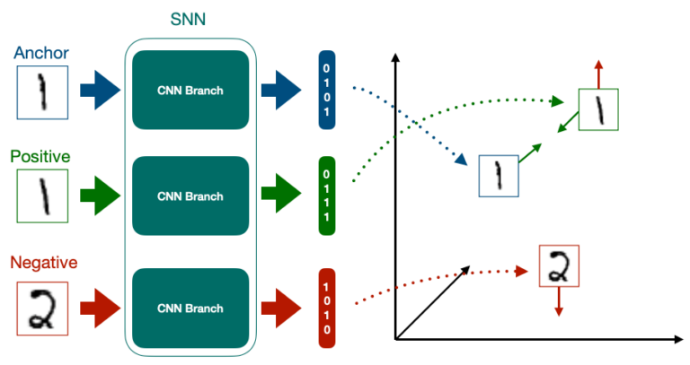

# Person Re-Identification with Siamese Network


*Siamese Network illustration by [Cameron Trotter](https://towardsdatascience.com/how-to-train-your-siamese-neural-network-4c6da3259463/), Feb 19, 2021*

## Overview

This project implements a person re-identification system using a Siamese network architecture. Person re-identification is the task of matching images of the same person across different camera views, which is crucial for surveillance and security applications.

The system uses a deep learning approach with a Siamese network to learn discriminative features that can identify the same person across different views, poses, and lighting conditions.

## Features

- **Siamese Network Architecture**: Uses a shared-weight neural network to learn embeddings for person images
- **Triplet Loss**: Implements triplet loss function to learn discriminative embeddings
- **Evaluation Metrics**: Includes Mean Average Precision (mAP) and Cumulative Matching Characteristics (CMC) for performance evaluation
- **Visualization Tools**: Provides tools to visualize embeddings and query results
- **Automated Pipeline**: Complete pipeline for training, validation, and testing
- **Docker Support**: Containerized environment for easy deployment

## Dataset

This project uses the Market-1501 dataset, which contains 32,668 images of 1,501 pedestrians captured from 6 different cameras. Each person has multiple images from different camera views.

The dataset is not included in this repository due to size constraints, but it can be automatically downloaded and prepared using the provided Makefile commands.

## Installation

### Prerequisites

- Python 3.10+
- PyTorch 2.0+
- uv (Python package installer and environment manager)


### Option 1: Using Make (Recommended)

1. Clone the repository:
   ```bash
   git clone https://github.com/benintw/person-reid.git
   cd person-reid
   ```

2. Set up the environment and install dependencies:
   ```bash
   make setup-env
   source .venv/bin/activate  # On Windows: .venv\Scripts\activate
   ```

3. Download and prepare the dataset:
   ```bash
   make download-market1501
   make extract-market1501
   make prepare-data
   ```

### Option 2: Using Docker

1. Clone the repository:
   ```bash
   git clone https://github.com/benintw/person-reid.git
   cd person-reid
   ```

2. Build and run the Docker container:
   ```bash
   docker-compose up -d person-reid
   ```

3. For interactive development with Jupyter Notebook:
   ```bash
   docker-compose up -d notebook
   ```
   Then access the notebook at http://localhost:8888

## Usage

### Training

```bash
# Using Make
make train

# Using Docker
docker-compose run person-reid make train
```

### Validation

```bash
# Using Make
make validate

# Using Docker
docker-compose run person-reid make validate
```

### Testing/Prediction

```bash
# Using Make
make predict

# Using Docker
docker-compose run person-reid make predict
```

### Analysis

```bash
# Analyze predictions with visualizations
make analyze

# Explore predictions without requiring image files
make explore
```

### Complete Pipeline

```bash
# Run training, validation, and testing in sequence
make all
```

## Project Structure

```
person-reid/
├── configs/               # Configuration files
├── data/                 # Dataset directory
├── checkpoints/          # Saved model checkpoints
├── results/              # Evaluation results
├── logs/                 # Training logs
├── scripts/              # Training and evaluation scripts
├── src/                 # Source code
│   ├── data/            # Data loading and preprocessing
│   ├── models/          # Model architecture definitions
│   ├── losses/          # Loss function implementations
│   ├── inference/       # Inference and prediction code
│   └── utils/           # Utility functions
├── Dockerfile           # Docker configuration
├── docker-compose.yml   # Docker Compose configuration
├── Makefile             # Automation commands
└── requirements.txt     # Python dependencies
```

## Model Architecture

The model uses a Siamese network architecture with a shared backbone network (ResNet-50) to extract features from person images. The network is trained using triplet loss to learn discriminative embeddings that minimize the distance between images of the same person and maximize the distance between images of different people.

## Evaluation Metrics

- **Mean Average Precision (mAP)**: Measures the overall performance of the retrieval system
- **Cumulative Matching Characteristics (CMC)**: Shows the probability that a query person appears in different-sized candidate lists
  - Rank-1: The percentage of queries where the correct match is the top result
  - Rank-5: The percentage of queries where the correct match is in the top 5 results
  - Rank-10: The percentage of queries where the correct match is in the top 10 results

## License

This project is licensed under the MIT License - see the LICENSE file for details.

## Acknowledgments

- Market-1501 dataset: Zheng et al. "Scalable Person Re-identification: A Benchmark"
- Triplet Loss: Schroff et al. "FaceNet: A Unified Embedding for Face Recognition and Clustering"
